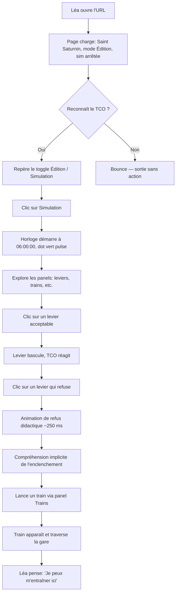
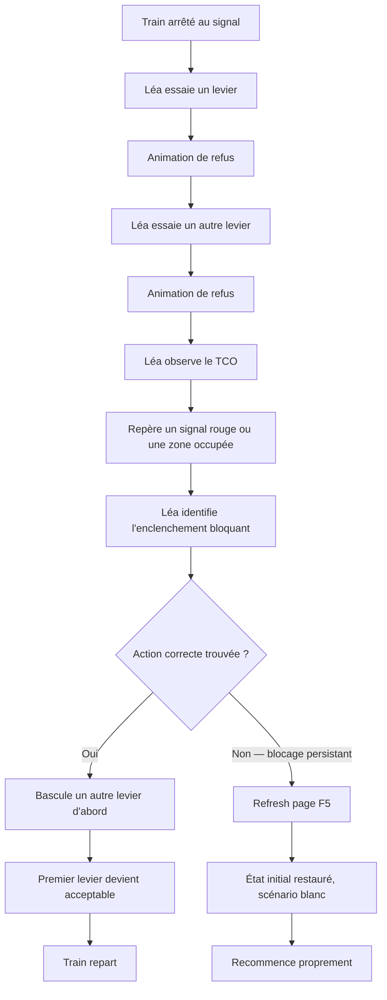
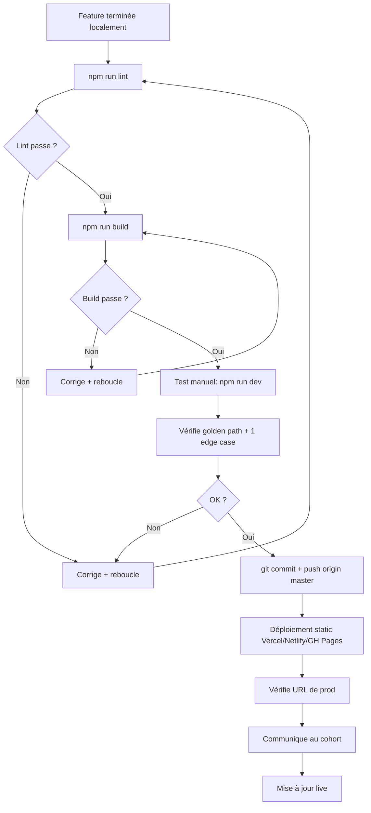
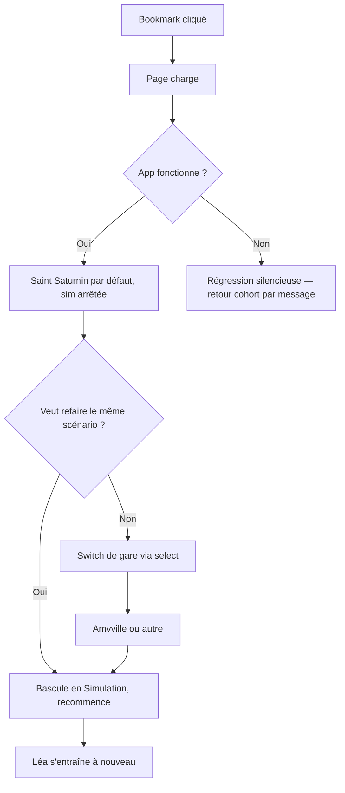

# Spécification de Design UX — gessieWeb

**Auteur :** Guill
**Date :** 2026-05-02

---

<!-- Le contenu sera ajouté de manière séquentielle au fil des étapes du workflow collaboratif -->

## Synthèse exécutive

### Vision du projet

gessieWeb est un portage web fidèle de Gessie (simulateur SNCF de signalisation, Vue/Electron desktop) destiné à supprimer le mur d'installation pour les stagiaires sur Mac, Linux et postes de centre de formation verrouillés. La posture est **soustractive et non additive** : on ne change ni la simulation, ni le vocabulaire métier, ni le comportement — on déplace seulement le canal de distribution. La Phase 1 MVP livre deux gares (`saint_saturnin`, `amvville`), une interface 100 % en français, et un déploiement sur hébergement statique gratuit (Vercel / Netlify / GitHub Pages).

L'auteur (Guill) est lui-même un nouveau OPC SNCF en formation. Cette posture dicte une exigence d'authenticité : le vocabulaire métier (carré, sémaphore, EAP/EPA, ATR, cantonnement BAL, FA) reste intact, et les conventions visuelles évoquent le poste d'aiguillage physique partout où ça aide à la mémorisation pour le futur passage au poste réel.

### Utilisateurs cibles

**Persona principal — Léa Robert** (du PRD)
- 22 ans, première année OPC, MacBook personnel, postes du centre verrouillés
- Connaît le vocabulaire SNCF fondamental mais découvre les outils logiciels
- Motivée, peur de "casser quelque chose", apprend mieux par tâtonnement contrôlé
- 4 parcours documentés au PRD : succès direct, recovery après blocage, retour, déploiement par Guill

**Persona secondaire — Guill, mainteneur solo**
- Déploie, met à jour les fixtures de gares, ajoute des perturbations
- Workflow : `npm run lint && npm run build` puis push static — pas de CI

**Cohorte cible Phase 1** : 5 stagiaires de la promotion de Guill sur 3 mois = seuil de succès. Pas de cible numérique au-delà.

**Visiteurs froids** (curieux non-stagiaires arrivant sur l'URL) : non-prioritaires en Phase 1 mais pas exclus ; FR24-25 sont conditionnels-MVP si la mesure d'usage révèle le besoin.

### Défis de design clés

1. **Refus silencieux du sim → feedback opérateur lisible.** La couche `src/sim/*` retourne `state` inchangé quand un garde refuse une action (convention : pas de `throw`, pas de log). Aujourd'hui seul `LeversPanel` implémente un feedback (flash rouge 600 ms). Les 7 autres panels sont silencieux. **Décision déjà prise pour les leviers de contrôle (C\*, Cv\*) et d'aiguilles (Ag\*) : animation de bascule avortée — le manche tente de pivoter, bute, revient à l'origine avec une légère oscillation.** Reste à définir un pattern de feedback de refus pour les autres familles d'action (Blocs, ATR, Clés, CommutFC, Perturbations, Trains) — visuel cohérent, non-bruyant, sans casser la posture soustractive.

2. **Densité du TCO + empilement vertical des 8 panels.** L'écran combine un viewport SVG dense (10 à 80 items selon la gare) et 8 panels d'opérateurs empilés sous le viewport. Sur écran 1280×720 (résolution minimum NFR-COMP-002), Léa scrolle constamment. Hiérarchie visuelle et regroupement = enjeu central.

3. **Mode Edit ↔ Play sans repère fort.** Aujourd'hui un seul bouton "Lancer simulation" bascule l'app en mode Play. En Edit mode, les panels deviennent des no-op silencieux. Léa peut cliquer sans comprendre pourquoi rien ne réagit. Le mode courant doit être lisible en permanence sans surcharger l'interface.

4. **Skeuomorphisme ciblé vs. propreté web.** Décision prise : panneau métallique pour leviers de contrôle et d'aiguilles (aide à la mémorisation pour le futur passage au poste réel). Le défi : ne pas étendre ce style aux autres panels où il deviendrait du bruit, tout en gardant une cohérence visuelle d'ensemble.

5. **Onboarding visiteur froid (différé Phase 2 mais conditionnel-MVP).** FR24-25 prévoient une explication minimale ("c'est quoi ce truc ?") si la mesure d'usage révèle des bounces. Pas de tutoriel intégré (non-goal Phase 1). Question à ouvrir : page d'accueil, bandeau persistant, lien vers Gessie original ?

### Opportunités de design

1. **L'animation du levier comme dispositif didactique.** Le levier qui "bute" puis revient n'est pas qu'un feedback — c'est l'enseignement de l'enclenchement mécanique. Léa apprend pourquoi elle ne peut pas en *ressentant* le verrouillage. C'est l'opposé d'une erreur web classique ("cette action n'est pas autorisée") : c'est une métaphore physique qui reproduit le réel.

2. **Le TCO comme centre de gravité.** Le viewport SVG est la "vérité" — l'état réel du poste. Les panels orbitent autour. Renforcer cette hiérarchie visuelle (le viewport prend la majeure partie de l'écran ; les panels sont des outils à portée de main) clarifie l'usage et reproduit la disposition mentale du poste réel.

3. **Hiérarchie des panels par fréquence d'usage.** Leviers + cantonnements représentent probablement 80 % des actions opérateur ; ATR, clés, perturbations sont occasionnels. La proéminence visuelle peut refléter cette hiérarchie au lieu d'un empilement uniforme de 8 cartes.

4. **La gare par défaut comme parcours d'apprentissage.** `saint_saturnin` n'est pas un choix arbitraire — c'est la gare avec le setup C211/commutFC, premier scénario que Léa apprend. Le sélecteur de gare peut devenir un fil pédagogique (gare 1 → fondamentaux ; gare 2 → cas avancé), pas juste une liste alphabétique.

5. **Authenticité française = signal de confiance.** Léa reconnaît immédiatement le vocabulaire de ses cours. Cette précision lexicale est un atout différenciant, pas une contrainte. Le design renforcera cette authenticité (typographie sobre, codes couleur dérivés du livre de signalisation SNCF).

## Expérience utilisateur cœur

### Définition de l'expérience

Le cœur de gessieWeb est une **boucle d'observation-action sur le TCO** qui simule le travail d'un agent de poste d'aiguillage :

1. **Observer** la situation dans le viewport SVG (un train approche, un signal est ouvert, une zone est libre).
2. **Décider** de l'action requise (basculer un levier, fermer un carré par commutFC, donner une autorisation ATR, prendre une clé).
3. **Agir** depuis le panel d'opérateur correspondant — un seul clic, jamais de confirmation.
4. **Valider** le résultat sur le TCO (le manche du levier bascule, le signal change de couleur, la zone change de teinte).
5. **Recommencer.**

L'aller-retour mental **TCO ↔ panel ↔ TCO** doit être sans friction. C'est l'unique parcours qui doit être parfaitement fluide ; tout le reste (perturbations, changement de gare) est secondaire.

### Stratégie plateforme

| Dimension | Décision Phase 1 |
|---|---|
| Type | Application web (SPA), une seule URL |
| Résolution mini | 1280 × 720 (NFR-COMP-002) |
| Entrée | Souris + clavier |
| Tactile | Non optimisé (mais non cassé sur tablette) |
| Hors ligne | Non — connexion requise pour le chargement initial |
| Navigateurs | Cible Vite par défaut : Chrome / Firefox / Safari / Edge récents (≥ 2 versions) |
| Auth | Aucune — URL → app fonctionnelle |
| Stockage local | Aucun en Phase 1 (état perdu au refresh, conforme au pédago "scénario propre") |

### Interactions sans friction

Les interactions où Léa ne doit *jamais* avoir à réfléchir :

1. **Clic sur un levier → bascule visuelle immédiate.** Pas de loading spinner, pas de modale, pas de message de confirmation.
2. **Refus = explication intégrée à l'animation.** L'enclenchement n'est pas un message d'erreur, c'est un comportement physique simulé. Léa comprend en regardant.
3. **Changement de gare → remount instantané.** Sélection dans le `<select>`, l'écran se reconstruit. Pas de "Êtes-vous sûr ?".
4. **Lancer la simulation → un seul clic, démarrage immédiat.** Pas de paramètres avant lancement (les paramètres se règlent en mode Edit).

### Moments clés du succès

Quatre moments font ou défont l'expérience de Léa :

1. **Le premier clic réussi.** Léa bascule un levier ; le manche descend, le TCO réagit. C'est *cinq secondes après* avoir ouvert l'URL. Elle pense : "Ça marche."

2. **Le premier refus compris.** Léa tente une action incohérente. Le levier amorce sa bascule, bute, revient. Pas de pop-up. Léa comprend l'enclenchement mécanique, pas en lisant un message mais en *ressentant* la métaphore. Elle pense : "C'est cohérent avec ce que j'apprends en cours."

3. **Le scénario complet sans aide.** Léa fait transiter un train de bout en bout sur saint_saturnin (ou amvville), avec un cantonnement BAL fonctionnel, sans bug, sans qu'on lui ait expliqué l'app. Elle pense : "Je peux m'entraîner ici."

4. **Le retour le lendemain.** Léa revient sur l'URL. L'app fonctionne. Pas d'install, pas de mise à jour, pas de cassure. La promesse soustractive est tenue.

### Principes directeurs de l'expérience

Cinq principes guideront toutes les décisions UX qui suivent :

1. **Action directe, feedback immédiat.** Le clic *est* l'action. Le feedback est visuel, sur l'élément concerné, en moins de 100 ms. Aucune confirmation, aucune modale, aucun toast.

2. **Le TCO est la vérité.** Toute action se valide dans le viewport SVG. Les panels portent les commandes ; le TCO porte le résultat. Cette boucle observable est la pédagogie.

3. **Vocabulaire SNCF intact.** Pas de traduction, pas de simplification. "Carré", "EAP", "ATR", "cantonnement" — Léa apprend ces termes en cours, l'app les *utilise*, elle ne les *enseigne* pas.

4. **Skeuomorphisme là où ça enseigne, sobriété ailleurs.** Panneau métallique pour les leviers C/Cv/Ag (poste réel) ; design flat fonctionnel pour les outils annexes (perturbations, sélecteur de gare, contrôles de simulation).

5. **Zéro mur d'entrée.** URL → app fonctionnelle. Pas d'auth, pas d'install, pas de tutoriel obligatoire. L'apprentissage vient du tâtonnement contrôlé, pas du onboarding.

## Réponse émotionnelle souhaitée

### Émotion centrale

**Compétence calme.** Léa se sent capable, concentrée, comme à son cours mais en autonomie. Pas "empowered" (trop générique), pas "delighted" (ce n'est pas un jeu). C'est l'émotion de *savoir faire son métier* — la même qu'un pro ressent à son poste.

### Émotions à favoriser

| Émotion | Vs. | Comment l'obtenir |
|---|---|---|
| **Confiance** | Confusion | Animation de refus didactique, feedback précis sur l'élément concerné, vocabulaire juste |
| **Concentration** | Distraction | Palette sobre, peu de mouvement parasite, l'interface s'efface au profit du sim |
| **Authenticité** | Gamification | Skeuomorphisme ciblé, terminologie SNCF intacte, codes couleurs du livre de signalisation |
| **Autonomie** | Dépendance | Pas de tuto obligatoire, pas de profile, pas de help mode imposé |

### Émotions à éviter absolument

1. **Frustration silencieuse** — clics sans feedback. Risque n° 1, adressé par l'animation de refus.
2. **Condescendance** — "Êtes-vous sûr ?", "Bravo !", tooltips pédagogiques non sollicités.
3. **Anxiété de l'erreur** — alertes alarmistes alors qu'aucune action n'est irréversible.
4. **Bruit visuel** — surcharge décorative, badges, gamification gratuite.
5. **Surprise esthétique** — animations parasites qui détournent du métier.

### Parcours émotionnel

| Étape | Émotion cible |
|---|---|
| Découverte (URL) | Curiosité calme, **pas** de "wow" forcé |
| Premier clic | "Ça réagit" — confiance naissante |
| Premier refus | "Je comprends pourquoi" — apprentissage actif |
| Pendant le sim | Concentration, oubli de l'interface |
| Erreur opérateur (train arrêté, scénario bloqué) | "Je peux corriger" — pas de panique |
| Fin de session | Accomplissement discret |
| Retour le lendemain | "Toujours là, toujours fonctionnel" — fiabilité |

### Implications design

- **Confiance** → animation de refus didactique au lieu de message d'erreur, feedback visuel précis sur l'élément concerné, vocabulaire SNCF juste.
- **Concentration** → palette sobre (bleu nuit, gris acier, blanc cassé), peu de mouvement parasite, pas d'animation décorative, typographie discrète.
- **Authenticité** → skeuomorphisme ciblé (leviers métalliques uniquement), terminologie SNCF intacte, codes couleurs du livre de signalisation.
- **Sécurité** → état perdu au refresh = OK car attendu (scénario propre), pas d'alerte alarmiste, possibilité de tout réinitialiser en un clic.
- **Autonomie** → pas de tuto obligatoire, pas de help mode imposé, pas de profile à créer.

### Principes émotionnels directeurs

1. **Sérieux sans austérité.** Outil professionnel reconnu — ni jeu vidéo, ni formulaire administratif. Le ton est calme et précis.

2. **Le silence comme respect.** Pas de notification, pas de confirmation, pas de félicitation. Pas de "Bravo !" après une bascule réussie, pas de toast "Train arrivé en gare". L'absence de bruit montre qu'on prend Léa au sérieux comme professionnelle.

3. **L'erreur enseigne, ne sanctionne pas.** Le refus est une métaphore physique (le levier qui bute), pas une réprimande. Aucune phrase ne dit à Léa qu'elle "s'est trompée".

4. **L'interface s'efface devant le sim.** Le but n'est pas que Léa admire l'app ; c'est qu'elle oublie qu'elle utilise une app et se concentre sur le poste.

5. **Fiabilité = confiance silencieuse.** Pas de "v1.2.3 mise à jour disponible", pas de banner de statut, pas de "saved !". L'app fonctionne, point.

## Analyse de patterns UX & inspirations

### Sources analysées

#### 1. Gessie original — référence absolue de fidélité

Le simulateur Vue/Electron qu'on porte. Capture analysée : gare Saint Saturnin, état "Absence de train". Screenshot inclus dans `visualReferences`.

**Ce qu'on garde fidèlement :**
- Précision SVG du TCO (rails, signaux, aiguilles, zones de cantonnement avec leurs étiquettes exactes)
- Vocabulaire SNCF intégral : FA, EAp, ZAp, EP, FC, ATr, AnnFA, sub, vs, ep — aucune simplification
- Codes couleurs des signaux (point rouge = fermé, jaune = annonce, etc.)
- Layout fondamental : TCO en haut, outils opérateur en bas
- Sérieux fonctionnel : aucune fioriture, aucune icône décorative

**Ce qu'on modernise :**

| Aspect Gessie | Direction gessieWeb |
|---|---|
| Palette gris-blanc style Windows 95 | Bleu nuit + gris ardoise (sombre, contemporain) |
| Police système basique | Typographie technique moderne (Inter pour UI, IBM Plex Mono ou JetBrains Mono pour codes signal) |
| Boutons FC ronds éparpillés | Regroupés en bandeau cohérent par famille |
| Leviers bois clair / plaque dorée | Métallique acier sombre — direction Claude design |
| Aucune animation de refus | Animation de bascule avortée — innovation didactique |
| Pas de hiérarchie visuelle entre familles | Séparateurs/groupes : leviers / cantonnements / clés / perturbations |
| Fond TCO blanc pur | Gris-bleu très pâle pour réduire fatigue oculaire (à valider en rendu) |

#### 2. Postes SNCF physiques (PRS, PIPC, postes mécaniques)

**Source du skeuomorphisme métallique.** Justification pédagogique : Léa va s'asseoir devant un vrai poste un jour ; le levier doit lui rappeler la sensation. C'est la raison d'être du panneau métallique pour les leviers C/Cv/Ag.

À retenir : disposition en bandeau horizontal des leviers, étiquetage numéro + identifiant, manche vertical qui bascule, sensation de masse mécanique.

#### 3. Simulateurs ferroviaires (OpenTTD, Train Simulator Classic, BVE Trainsim)

Conventions de représentation ferroviaire, gestion d'états multiples sur un même item, vue tableau de bord. Pas de transposition directe (gessieWeb n'est pas un sim de conduite) mais validation que le grand public ferroviaire accepte les TCO denses.

#### 4. Outils pro denses (AutoCAD, Logic Pro, DAWs type Ableton)

**Densité d'information sans bruit.** Les pros acceptent — et préfèrent — un écran chargé si chaque pixel a un sens. Palette sombre sobre, panneaux modulaires, typographie discrète. Référence pour la barre des panels opérateurs de gessieWeb.

#### 5. Excalidraw, tldraw, CodePen

**Zéro mur d'entrée.** URL → outil fonctionnel. Pas d'auth, pas de profile, pas de tutoriel obligatoire. Référence directe pour le principe "URL → app" du PRD.

#### 6. Linear, Cron

**Sobriété pro contemporaine.** Typographie discrète, animations utilitaires (jamais décoratives), palette sombre subtile. Référence pour le ton émotionnel "compétence calme" et "le silence comme respect".

### Patterns transférables

#### Patterns de navigation

- **Sélecteur unique en haut** (Linear, Excalidraw) → pour le `<select>` de gare. Pas de sidebar, pas de menu.
- **Pas de routage** (CodePen, Excalidraw) → conforme au choix gessieWeb (une seule URL, état dans le store, pas de React Router).
- **Bandeau d'outils horizontal sous le canvas** (DAWs, AutoCAD) → modèle pour la barre des panels opérateurs.

#### Patterns d'interaction

- **Action directe sans confirmation** (Excalidraw, Logic Pro) → un clic = une action, le résultat se voit.
- **Animation comportementale plutôt que message** (Logic Pro fader qui résiste) → modèle direct pour l'animation de levier qui bute.

#### Patterns visuels

- **Palette sombre + accents minimaux** (Linear, Cron, DAWs) → soutient compétence calme et concentration.
- **Skeuomorphisme contrôlé** (DAWs : faders, knobs réalistes ; le reste flat) → modèle exact de notre choix : métallique pour leviers C/Cv/Ag, flat pour le reste.
- **Typographie monospace pour codes/identifiants** (Linear pour issue IDs, GitHub pour SHA) → pour les codes signal C211, Cv215VU, etc.

### Anti-patterns à éviter

1. **Onboarding tutoriel forcé** (Notion, Slack, SaaS B2B) — overlay obligatoire qui bloque l'usage réel. Contraire à zéro mur d'entrée et au respect de Léa comme adulte professionnelle.

2. **Gamification d'apprentissage** (Duolingo, Codecademy) — XP, badges, streaks, niveaux. Contraire à compétence calme et sérieux sans austérité. Léa apprend un métier, pas une langue ludique.

3. **Modales de confirmation systématiques** (admin SaaS classique) — "Êtes-vous sûr ?", "Cette action est irréversible". Contraire à action directe, feedback immédiat et au silence comme respect. D'autant qu'aucune action gessieWeb n'est irréversible.

### Stratégie d'inspiration

#### À adopter directement

- **Le TCO et le vocabulaire de Gessie** — porter fidèlement, sans réinterprétation.
- **Le pattern levier physique des postes SNCF** — bandeau horizontal, manche vertical, étiquette numérotée.
- **La palette sombre sobre de Linear/Cron/DAWs** — bleu nuit, gris ardoise, accents discrets.
- **Le pattern URL-only d'Excalidraw** — pas d'auth, pas de routage, pas de profile.

#### À adapter

- **Le skeuomorphisme des DAWs** — appliquer aux leviers uniquement, garder flat ailleurs.
- **L'animation comportementale de Logic Pro** — étendre à un pattern de refus généralisé pour tous les panels.
- **La densité d'AutoCAD** — adopter le principe, mais regrouper visuellement par famille (ce que Gessie ne fait pas).

#### À éviter

- Tout onboarding bloquant ou tutoriel obligatoire (anti-pattern n° 1).
- Toute gamification ou badge de progression (anti-pattern n° 2).
- Toute modale de confirmation (anti-pattern n° 3).
- Toute notification push, toast de succès, banner de statut (cf. principe "le silence comme respect").

## Fondation du design system

### Décision : design system custom ultra-léger, design tokens TypeScript

Pas un framework. Pas une library externe. **Une couche de constantes TypeScript** (`src/design/tokens.ts`) consommée par les composants existants en inline-style.

#### Contraintes héritées

| Contrainte | Source | Implication design system |
|---|---|---|
| Inline `style={{}}` uniquement | `_bmad-output/project-context.md` | Pas de CSS-in-JS, pas de CSS Modules, pas de Tailwind |
| Pas de library UI | `_bmad-output/project-context.md` | Pas de Material UI, Ant Design, Chakra, Mantine, Radix |
| TCO en SVG procédural | `docs/architecture.md` | Aucune library UI ne couvre les primitives métier |
| Skeuomorphisme métallique | Décision UX (étape 2) | Aucun système existant ne le fournit |
| Solo dev, pas de design budget | PRD | Pas de design system enterprise complet à maintenir |

### Justification du choix

1. **Conforme aux 95 règles du `project-context.md`** sans aucune dérogation.
2. **Zéro coût d'apprentissage** — tout est du React + TS + inline-style standard, déjà maîtrisé.
3. **Permet le skeuomorphisme custom** (leviers métalliques, animation de refus) qu'aucun système off-the-shelf ne fournit.
4. **Démontable** — si demain on bascule de paradigme, on jette `src/design/` sans casser le sim ou le store.
5. **Stable face aux upgrades Vite/React/Zustand** — pas de chaîne de dépendances UI à maintenir.

### Approche d'implémentation

```
src/design/
├── tokens.ts          ← palette, typo, espacements, rayons, ombres, durées
├── primitives/        ← composants UI réutilisables (style inline + tokens)
│   ├── Panel.tsx      ← bandeau d'outils (boîte sombre arrondie)
│   ├── Button.tsx     ← bouton standard (actions discrètes)
│   ├── Lever.tsx      ← levier métallique (C/Cv/Ag) — gère l'animation de refus
│   ├── KnobButton.tsx ← bouton rond style commutateur (FC, AnnFA)
│   └── KeyHole.tsx    ← serrure / cadenas
└── README.md          ← référence d'usage
```

#### Phase 1 — création immédiate

Créer `src/design/tokens.ts` avec **6 catégories de tokens** :

- **Couleurs** : palette sombre (bleu nuit, gris ardoise, accents) + sémantique signal (rouge fermé, jaune annonce, blanc idle, etc.)
- **Typographie** : `Inter` pour l'UI, `IBM Plex Mono` pour les codes signal (C211, Cv215VU). Tailles, graisses, line-heights définis comme constantes. Polices auto-hébergées dans `public/fonts/` pour éviter la dépendance à Google Fonts.
- **Espacements** : grille 4px (4, 8, 12, 16, 24, 32, 48, 64)
- **Rayons** : 4 niveaux (`none`, `sm`, `md`, `lg`)
- **Ombres** : 3 niveaux (`sm` pour cartes, `md` pour panels élevés, `metallic` pour leviers)
- **Animations** : durées (`instant: 0ms`, `fast: 120ms`, `slow: 300ms`), easings (`linear`, `ease-out`, `ease-in-out`)

#### Phase 2 — extraction au fil de l'eau

Quand un pattern se répète dans 2+ panels, extraire vers `src/design/primitives/`. Ne pas extraire prématurément.

#### Pas de Storybook, pas de Figma sync, pas de générateur

Documentation = `src/design/README.md` + code lisible. Solo dev, pas besoin de surcouche.

### Stratégie de personnalisation

#### Limites de inline-style et solutions

| Limitation | Solution |
|---|---|
| Pas de `:hover` / `:focus` / `:active` | `onMouseEnter/Leave` + état React local |
| Pas de `@keyframes` CSS | Transition inline (`transition: 'transform 200ms ease-out'`) avec `transform` via state React. Pour anim refus levier : `requestAnimationFrame` ou Web Animations API. |
| Pas de media queries | Phase 1 desktop only ≥ 1280px → non bloquant. Phase 2 (responsive) : hook `useViewport()` qui retourne tailles selon `window.innerWidth`. |
| Pas de variables CSS | Constantes TS importées (équivalent fonctionnel parfait). Refactoring possible vers CSS custom properties si besoin futur. |

### Polices auto-hébergées

`Inter` (Variable Font) + `IBM Plex Mono` placées dans `public/fonts/`, déclarées via `@font-face` dans `index.html` (seul endroit où on dérogeera à inline-style — limite technique de chargement de polices). Pas de chargement Google Fonts pour respecter NFR-SECU (pas de tracker tiers).

### Tokens nommés et utilisation

L'usage des tokens dans les composants suivra ce pattern :

```tsx
import { colors, spacing, typography, shadows } from '../../design/tokens';

export function Panel({ children }) {
  return (
    <div style={{
      background: colors.surface.dark,
      padding: spacing.md,
      borderRadius: 8,
      boxShadow: shadows.md,
      fontFamily: typography.ui.fontFamily,
    }}>
      {children}
    </div>
  );
}
```

Les tokens sont **typés strict** (TypeScript) ; toute faute de frappe casse le build.

## Expérience signature

### L'expérience définissante : le levier qui bute

> Léa clique un levier qu'elle ne peut pas basculer. Le manche commence à pivoter, s'enclenche d'un cran, bute. Une micro-oscillation. Il revient à la position d'origine. Pas de message. Pas de toast. Léa a compris.

C'est le moment qui condense **toute la stratégie UX en 250 millisecondes** :

- Vocabulaire SNCF intact (le levier, l'enclenchement)
- Skeuomorphisme métallique (le levier est physique)
- Action directe + feedback immédiat
- Compétence calme (pas d'alerte dramatique)
- L'erreur enseigne, ne sanctionne pas
- TCO comme vérité (le résultat se voit ailleurs, pas dans le panel)

Si on rate ce moment, tout le reste est compromis. Si on le réussit parfaitement, c'est ce que Léa raconte au cohort.

### Modèle mental de l'utilisatrice

Léa a déjà un modèle mental pré-formé par ses cours :

- Un levier est un objet physique avec une masse
- Un enclenchement mécanique empêche certaines combinaisons
- Quand un levier ne veut pas basculer, c'est qu'un autre est dans une position incompatible
- Dans la vraie vie : pas de popup, le levier résiste, point.

**Notre design épouse son modèle mental.** On n'éduque pas Léa à un nouveau pattern UX — on réutilise ce qu'elle apprend en cours. C'est l'exact opposé d'un onboarding tutoriel.

### Critères de succès

| Indicateur | Cible |
|---|---|
| Durée animation refus complète | ≤ 400 ms (lisible mais non bloquante) |
| Durée animation acceptée | ≤ 300 ms |
| Compréhension du refus au 1er essai | ≥ 80 % des stagiaires de la cohorte (mesure par interview qualitative) |
| Léa cherche un message d'erreur | 0 % (signal d'échec si > 0) |
| Action utile suivante après refus | < 30 s (mesure indirecte de compréhension) |

### Pattern : hybride familier-établi + twist didactique

| Composant | Statut |
|---|---|
| Skeuomorphisme du levier | **Établi** — DAWs, sims industrielles, postes SNCF physiques |
| Feedback animé sans modale | **Établi** — Logic Pro fader qui résiste, Twitter like animation |
| Animation comme **explication** d'une logique métier | **Novel** — c'est ici que gessieWeb innove |

L'innovation est dans la **finalité didactique** de l'animation, pas dans la mécanique d'animation elle-même. Pas d'éducation utilisateur nécessaire.

### Mécaniques détaillées

#### 1. Initiation

- Hover sur le levier → ombre légèrement plus prononcée + `cursor: pointer`. Signal "cliquable".
- **Pas** de tooltip "Cliquez pour basculer" — superflu.

#### 2. Interaction

- Clic → animation démarre immédiatement (manche pivote vers la position cible).
- Côté code : `toggleLever(id)` appelé synchroneous, `ActionResult` retourné instantanément.
- L'état d'animation est **local au composant `Lever`** (pas dans Zustand).

#### 3. Feedback — cas accepté

Manche complète sa rotation idle→actif (haut→bas) ou inverse. Durée totale ~250 ms. Le TCO réagit en parallèle (signal change d'état, voie change de teinte). **Aucun autre feedback.** Pas de toast, pas de "saved !".

#### 3. Feedback — cas refusé (la signature)

1. Manche commence sa rotation (~30 % de l'angle cible, ~80 ms)
2. Bute brutalement (transition stoppée)
3. Micro-oscillation : 1 à 2 vibrations de ±3° sur ~60 ms (= sensation de résistance mécanique)
4. Retour fluide à la position d'origine (~120 ms)
5. **Total : ~250-260 ms**

Pas de message. Pas de toast. Pas de changement de couleur. Le manche revient et c'est tout.

#### 4. Complétion

- **Accepté** : nouvelle position stable, validation visuelle sur le TCO.
- **Refusé** : retour à origine, levier à nouveau cliquable. Léa peut explorer (basculer un autre levier d'abord, lire le TCO pour comprendre).
- Pas de "done state", pas de notification de complétion.

### Détection technique du refus

Pattern actuel `LeversPanel.handleClick` à généraliser :

```ts
const handleClick = (id: string, positionBefore: 'plus' | 'minus') => {
  toggleLever(id);
  setTimeout(() => {
    const after = useGessieStore.getState().player.data?.levers[id]?.position;
    if (after === positionBefore) {
      // Refus → déclencher animation retour
      triggerRefusedAnimation(id);
    }
    // Sinon : l'animation continue jusqu'à la nouvelle position (pas d'action requise)
  }, 0);
};
```

Le `setTimeout(0)` laisse Zustand committer avant de lire `getState()`.

### Portée Phase 1 et stratégie d'extension

**Décision** : l'animation didactique complète est limitée aux **leviers C/Cv/Ag** en Phase 1.

Pour les autres familles d'action en Phase 1, fallback minimal pour éviter la "frustration silencieuse" (cf. émotions à éviter) :

| Famille | Phase 1 | Phase 2+ |
|---|---|---|
| Leviers C/Cv/Ag | **Animation didactique complète** (la signature) | Maintenue |
| CommutFC (bouton rond) | Flash subtil 600 ms sur le bouton refusé | Tente de tourner, bute, revient |
| ATR (pression bouton) | Flash subtil 600 ms | Tente de s'enfoncer, bute, remonte |
| Clés / Cadenas | Flash subtil 600 ms | La clé tente d'entrer, bute, sort |
| Blocs / Cantonnement | Flash subtil 600 ms | Bouton de test/reddition tente, bute, revient |
| Trains (spawn) | Flash subtil 600 ms | Bouton "Spawn" se rétracte, refuse, revient |
| Perturbations | N/A — pas de refus possible | N/A |

Le pattern actuel de `LeversPanel` (`setRefused` + couleur 600 ms) sera donc **généralisé à tous les panels en Phase 1**, puis remplacé par l'animation didactique pour chaque famille en Phase 2.

## Fondation visuelle

### Palette de couleurs

#### Surfaces (UI sombre)

| Token | Hex | Usage |
|---|---|---|
| `surface.darkest` | `#0F1419` | Fond app **et fond du TCO** (le TCO existant utilise déjà ce thème dark) |
| `surface.dark` | `#161B22` | Panels élevés (LeversPanel, etc.) |
| `surface.medium` | `#1E2530` | Cartes, sous-panels |
| `surface.light` | `#2A3343` | Éléments interactifs (hover) |

#### Texte

| Token | Hex | Contraste vs `surface.darkest` |
|---|---|---|
| `text.primary` | `#E6E8EC` | 14.5:1 ✓ AAA |
| `text.secondary` | `#9CA3AF` | 6.0:1 ✓ AA |
| `text.muted` | `#6B7280` | 4.6:1 ✓ AA (labels discrets, zones TCO type `z 215`) |
| `accent.signal-pn` | `#5B9BFF` | Identifiants de passage à niveau dans le TCO (`PN121`, `PN122`) |

#### Métallique — leviers C/Cv/Ag uniquement

| Token | Hex | Usage |
|---|---|---|
| `metal.base` | `#4B5460` | Corps du boîtier acier |
| `metal.highlight` | `#6E7787` | Reflet haut du boîtier |
| `metal.shadow` | `#2A3038` | Creux du boîtier |
| `metal.knob` | `#B4BCC9` | Manche chromé |
| `metal.knob.shine` | `#E1E5EC` | Reflet sur manche |

#### Codes signal SNCF (intacts, repris du livre de signalisation)

| Token | Hex | Sémantique |
|---|---|---|
| `signal.feu.rouge` | `#E11D26` | Carré, sémaphore — feu rouge fermé |
| `signal.feu.jaune` | `#EAB308` | Annonce, AvAr, EAp/EPA |
| `signal.feu.vert` | `#22C55E` | Voie libre |
| `signal.feu.blanc` | `#F3F4F6` | Manœuvre |
| `signal.feu.violet` | `#8B5CF6` | Cv (carré violet) |
| `signal.zone.occupee` | `#DC2626` | Zone occupée |
| `signal.zone.verrouillee` | `#EAB308` | Zone verrouillée par itinéraire |
| `signal.zone.annulee` | `#6B7280` | Zone annulée |

#### Accents UI (sobres)

| Token | Hex | Usage |
|---|---|---|
| `accent.primary` | `#5B9BFF` | Bouton principal, focus ring |
| `accent.success` | `#22C55E` | Rare (OK silencieux) |
| `accent.warning` | `#F59E0B` | Perturbations actives |
| `accent.danger` | `#DC2626` | Refus (subtil, jamais bruyant) |

### Typographie

#### Polices (auto-hébergées dans `public/fonts/`)

- **Inter** (variable) → UI générale
- **IBM Plex Mono** (variable) → codes signal (`C211`, `Cv215VU`)

#### Échelle (taille / line-height)

| Token | Taille | LH | Usage |
|---|---|---|---|
| `xs` | 11 px | 16 px | Étiquettes minuscules, ID |
| `sm` | 12 px | 18 px | Labels secondaires |
| `base` | 14 px | 20 px | Corps de texte par défaut |
| `md` | 16 px | 24 px | Titres de panel |
| `lg` | 18 px | 26 px | Titres d'écran |
| `xl` | 22 px | 30 px | Header app |

#### Graisses

`regular: 400` · `medium: 500` · `semibold: 600` · `bold: 700`

### Espacements (grille 4 px)

`xxs: 4` · `xs: 8` · `sm: 12` · `md: 16` · `lg: 24` · `xl: 32` · `xxl: 48` · `xxxl: 64`

### Rayons et ombres

#### Rayons

`none: 0` · `sm: 2` · `md: 6` · `lg: 10` · `pill: 999`

#### Ombres

```ts
sm:              '0 1px 2px rgba(0,0,0,0.2)'                                        // cartes plates
md:              '0 4px 12px rgba(0,0,0,0.3)'                                       // panels élevés
metallic.outer:  '0 2px 8px rgba(0,0,0,0.5), inset 0 1px 0 rgba(255,255,255,0.05)'  // boîtier levier
metallic.knob:   '0 2px 4px rgba(0,0,0,0.4), inset 0 1px 1px rgba(255,255,255,0.4)' // manche
```

### Animations

#### Durées

`instant: 0` · `fast: 120ms` · `normal: 240ms` · `slow: 380ms`

#### Easings

- `linear`
- `easeOut: cubic-bezier(0.16, 1, 0.3, 1)` — sortie naturelle
- `easeInOut: cubic-bezier(0.65, 0, 0.35, 1)` — bascule fluide
- `bumpStop: cubic-bezier(0.7, 0, 0.84, 0)` — buttage abrupt du refus

### Accessibilité

| Critère | Niveau |
|---|---|
| Contraste texte sur surfaces | WCAG AA minimum (≥ 4.5:1), AAA pour `text.primary` |
| Pas de signalisation par couleur seule | États doublés (couleur + position + forme + animation) — pour daltoniens et codes signal SNCF |
| Focus visible | Ring 2 px `accent.primary` sur tout élément interactif |
| Tailles cliquables minimales | ≥ 32×32 px (cible WCAG 2.5.5) |
| Navigation clavier | Tous les contrôles atteignables au `Tab` — Phase 2, non prioritaire MVP |

### Layout & densité

- **TCO** prend la majeure partie de l'écran (≥ 60 % hauteur viewport sur 1280×720)
- **Bandeau panels** sous le TCO, empilement vertical des 8 panels regroupés visuellement en 3 zones :
  - **Gauche** : actions fréquentes (Leviers + CommutFC)
  - **Centre** : observation et cycle (SimControls + Trains + Blocs)
  - **Droite** : actions occasionnelles (ATR + Clés + Perturbations)
- Séparateurs subtils (`border.subtle`) entre zones, jamais de fond contrasté

## Décision de direction de design

### Direction validée

Une seule direction visuelle a été produite et validée — pas de variantes concurrentes. Elle exécute les choix accumulés des étapes 1 à 8 dans un mockup HTML statique : `_bmad-output/planning-artifacts/ux-design-direction.html`.

### Composition de la direction

#### Header

- Marque `gessieWeb` (suffixe `Web` en `accent.primary`)
- Sélecteur de gare (Saint Saturnin par défaut), composant flat sombre
- Toggle Édition / Simulation (segmented control, mode actif en `accent.primary`)
- Sélecteur de vitesse 0× / 1× / 2× / 5× / 10× (boutons mono compact)
- Horloge `06:14:32` à droite, avec dot `accent.success` glowing pour signaler le tick actif

#### TCO (zone centrale)

**Reproduction stylistique fidèle du code existant déjà implémenté.** Thème dark, fond `surface.darkest`, voies blanches `text.primary` 1.5px, zones (`z 105`, `z 111`, etc.) en `text.muted` avec petits rectangles blancs comme indicateurs d'occupation, joints isolants en pointillés blancs verticaux. Codes signal :

- **Carrés** (C211, C213, C220, C222, etc.) : texte et indicateur en `signal.feu.rouge`
- **Cv** (Cv212, Cv214, Cv215) : texte et cercle plein en `text.primary`
- **Sémaphores** (S219) : texte et cercle en `text.primary`
- **Identifiants PN** (`PN121`, `PN122`, `AUVA`) : `accent.signal-pn` (bleu)
- **Annonces** : cercles vides `text.primary`
- **Aiguilles** (11, 13, 14, 15a, 15b) : numéros `text.primary`
- **Flèches de direction** : `VU Nohans →`, `V1 LP →`, `V2 LP →`

#### Zone des panels (sous le TCO)

Grille 3 colonnes asymétriques (`1.9fr / 1fr / 1fr`) — la zone gauche prend la priorité spatiale puisqu'elle porte la signature visuelle (leviers).

##### Zone gauche — Actions fréquentes

**Panel Leviers** (la signature) :
- Bandeau horizontal de 12 leviers métalliques (40 × 76 px chacun)
- Manche vertical : `idle` = haut, `actif` = bas, `refused` = animation de bascule avortée
- Boîtier : dégradé acier sombre (`metal.highlight` → `metal.base` → `metal.shadow`), texture brossée subtile, indicateur de pivot central
- Étiquette sous chaque levier : numéro (`text.secondary`, semibold) + identifiant (`text.primary`, medium 11.5 px IBM Plex Mono)

**Commutateurs FC intégrés** :
- Disposés au-dessus du / des leviers qu'ils contrôlent (alignement précis par grid-column)
- FC C211 → levier 1 (span 1)
- FC C213 → leviers 2-3 C213VU et C213V1 (span 2)
- FC Cv215 → leviers 4-5 Cv215VU et Cv215V1 (span 2)
- Knob rond 26 px, indicateur central qui tourne de 45° quand actif
- Pas de FC pour AM, AU VA, PM, Cv212, Cv214, Ag13, Ag14 (cohérent : un FC = un signal carré)

##### Zone centre — Observation et cycle

**Panel Trains actifs** : liste compacte de cartes train avec ID en mono semibold, route, métadonnées, et bordure gauche `accent.primary` (ou `accent.success` selon état).

**Panel Cantonnement (BAL)** : grille de boutons d'action (Test, Reddition, Voie libre, Annonce).

##### Zone droite — Actions occasionnelles

**Panel ATR** : 3 boutons d'action (Pression, Autorisation, Annuler ATr en `btn-ghost-danger`).

**Panel Clés et serrures** : représentation visuelle façon Gessie :
- Cadenas SVG fermé avec clé enfoncée (état "prise")
- Cadenas SVG ouvert avec clé visible à côté (état "retirée")
- Gros cadenas central pour serrures partagées (Annexe Ibis)
- Plaques laiton numérotées (`0024`, `0031`) avec dégradé doré, fidèles aux brass-tags Gessie

##### Hors vue principale

Le panel **Perturbations** (DisturbancesPanel) n'est pas exposé dans la vue principale Léa. C'est un outil instructeur/édition. À placer ailleurs (Phase 2 : panneau dépliable, mode édition uniquement, ou écran séparé). À traiter dans le parcours utilisateur (étape 10).

### Justification

1. **Hiérarchie spatiale** : les leviers occupent la majeure partie de la zone panels (1.9fr) car ils portent la signature et sont l'action la plus fréquente.
2. **Densité authentique** : column-gap 4px entre leviers reproduit la densité des postes réels et de Gessie ; pas d'espacement gratuit.
3. **Cohésion FC + leviers** : intégrer FC au-dessus des leviers qu'ils contrôlent reproduit la disposition mentale du poste réel (un FC est conceptuellement attaché à son ou ses leviers).
4. **Clés visuelles, pas textuelles** : les boutons "Cv212vs / Cv212ep" ne disent rien à Léa ; les cadenas SVG montrent l'état d'un coup d'œil.
5. **Posture soustractive respectée** : tout ce qui n'est pas Léa-utile en Phase 1 (perturbations) est sorti de la vue principale.

### Approche d'implémentation

- Le mockup HTML sert de **référence visuelle** pour l'implémentation React, pas de spec d'intégration directe.
- Les valeurs CSS du mockup (variables `--surface-*`, `--metal-*`, `--signal-*`) seront portées vers `src/design/tokens.ts` (constantes TS typées) en phase de réalisation.
- Le TCO reste tel quel — aucun port à faire depuis le mockup.
- Les primitives `Lever`, `KnobButton`, `KeyHole` sont à extraire au fil de l'implémentation, avec le mockup comme cible de fidélité visuelle.
- L'animation de refus du levier sera implémentée en SVG `transform` via state React + `requestAnimationFrame` ou Web Animations API (l'animation CSS du mockup est une approximation pour la démo).

## Parcours utilisateur

Le PRD a déjà documenté les **narratifs** de 4 parcours (Léa cold-success, Léa stuck, Guill deploys, Léa returns). Cette section conçoit les **mécaniques détaillées** : flux pas-à-pas, surfaces UI touchées, points d'échec et de récupération.

> **Note Phase 1** : le panel `DisturbancesPanel` (perturbations / avaries) est reporté en Phase 2 et **n'est pas exposé** dans l'UI Phase 1. Aucun parcours ci-dessous ne le mentionne.

### Parcours 1 — Léa découvre l'app et réussit son premier scénario

**Entrée** : Léa ouvre une URL partagée par un camarade (`https://gessieweb.example/`).
**Objectif** : faire transiter un train sur Saint Saturnin sans aide externe.
**Durée cible** : < 5 minutes.



**Surfaces UI touchées** : Header (toggle mode + horloge) · Panel Leviers · Panel Trains · TCO

**Points d'échec et mitigations** :
- Léa n'identifie pas le toggle "Simulation" → bounce → trigger conditionnel-MVP des FR24-25 (page d'accueil ou bandeau d'aide léger en Phase 1+).
- L'animation de refus n'est pas comprise → précisément ce qu'on a conçu pour éviter (parcours 2 confirme ou infirme).
- Aucune cible n'a d'affordance visuelle de cliquabilité → contraire à notre design (tous les éléments cliquables ont hover + cursor pointer).

### Parcours 2 — Léa coince et récupère

**Entrée** : Léa est en pleine simulation, un train est arrêté à un signal et elle ne comprend pas pourquoi.
**Objectif** : sortir du blocage sans help externe.



**Surfaces UI touchées** : Panel Leviers · TCO · Header (refresh navigateur)

**Affordances de récupération en Phase 1** :
1. **Animation de refus répétée** : Léa peut tenter plusieurs leviers sans coût, comprendre par essai.
2. **Lecture du TCO** : couleurs des signaux et teintes des zones suffisent à identifier l'état bloquant.
3. **Refresh navigateur** (F5) : restaure l'état initial sans perte (pas de localStorage à protéger).
4. **Switch de gare** : `<select>` permet de changer de scénario via remount complet (`key={station?.id}`).

### Parcours 3 — Guill déploie une mise à jour

**Entrée** : Guill termine une feature en local et veut la pousser en prod.
**Objectif** : déployer sans casser l'expérience Léa.



**Surfaces UI gessieWeb** : aucune directement — workflow dev externe. Le déploiement = `git push` ; l'hébergeur statique prend le relai.

**Risque principal** : régression silencieuse (pas de test runner Phase 1). Mitigation = checklist manuelle dans `docs/development-guide.md` + soak-test rapide après déploiement.

### Parcours 4 — Léa revient le lendemain

**Entrée** : Léa rouvre le bookmark URL le lendemain.
**Objectif** : reprendre l'entraînement sans friction.



**Surfaces UI touchées** : URL bookmark · Header (gare-select + toggle mode) · TCO + panels comme parcours 1

**Promesse Phase 1** : aucune mémoire d'hier (pas de localStorage). Cohérent avec le pédago "scénario propre". Phase 2 pourra ajouter de la persistance (état levier, préférences gare) si le besoin émerge.

### Patterns de parcours communs

#### Pattern de navigation

- **Une seule URL, pas de routage** : tout l'état est dans Zustand. Refresh = état initial.
- **Sélecteur de gare = scénario** : changer de gare via `<select>` est le seul "saut" possible.
- **Pas de breadcrumb, pas de back / forward** : profondeur de navigation = 1.

#### Pattern d'action

- **Action directe, feedback immédiat** : un clic = une action. Toujours.
- **Refus = animation contextuelle** : pas de message, le comportement est l'explication.
- **Pas de confirmation** : aucune action gessieWeb n'est irréversible.

#### Pattern d'observation

- **Le TCO est la vérité** : toute action se valide visuellement dans le viewport.

#### Pattern de récupération

- **Refresh F5 = reset** : état initial restauré sans coût.
- **Switch de gare = nouveau scénario** : remount complet via `key={station?.id}`.
- **Pas de help intégré Phase 1** : le tâtonnement est l'apprentissage.

### Principes d'optimisation des flux

1. **Minimiser les étapes vers le succès** : Léa atteint son premier clic réussi en moins de 5 secondes après ouverture URL.
2. **Réduire la charge cognitive** : aucune action ne demande de paramétrage avant exécution. Les défauts sont sûrs.
3. **Feedback contextuel sur l'élément** : jamais de toast global ou de modale — le retour visuel est *là où l'action s'est passée*.
4. **Récupération sans perte** : F5 = reset propre, conforme au modèle pédagogique "scénario blanc".
5. **Pas de surprise** : tout ce qui est cliquable a un hover affordance ; tout ce qui ne l'est pas n'en a aucun.

## Stratégie de composants

Pas de design system externe → 100 % custom. Les 24 composants existants (`docs/component-inventory.md`) couvrent ~80 % des besoins ; cette section identifie les **12 primitives nouvelles** à créer dans `src/design/primitives/` et la stratégie de refactor des panels existants.

### Couverture actuelle

| Catégorie | Existant (à conserver) | Nouveau (à créer) |
|---|---|---|
| TCO renderers | 15 components fidèles (TcoAiguille, TcoControle, TcoSignal, TcoZone, TcoRail, TcoVoie, TcoTrace, TcoJoint, TcoLabel, TcoSvgIcon, TcoTraverse, TcoGenericPlaceholder, etc.) | aucun |
| App shell | App, TcoViewport, TcoCanvas | aucun |
| Panels d'opérateur | 8 panels (LeversPanel, TrainsPanel, BlocsPanel, AtrPanel, KeysPanel, CommutFCPanel, SimControls, DisturbancesPanel) | aucun, mais à **refactor** vers les nouvelles primitives |
| Primitives UI réutilisables | aucune | **12 nouvelles** (cf. ci-dessous) |

### 12 primitives à créer dans `src/design/primitives/`

| # | Primitive | Rôle | Priorité |
|---|---|---|---|
| 1 | `Lever` | La signature — boîtier métallique + manche + animation de refus | **P1** |
| 2 | `KnobButton` | Commutateur FC — knob rond avec indicateur rotatif | **P1** |
| 3 | `KeyHole` | Cadenas / serrure SVG — états fermé / ouvert, avec / sans clé | **P1** |
| 4 | `KeyTag` | Plaque laiton numérotée (clé physique) | **P1** |
| 5 | `Panel` | Boîte sombre avec titre + meta — wrapper standard | **P1** |
| 6 | `Button` | Variantes : default, primary, ghost, ghost-danger | **P1** |
| 7 | `ModeToggle` | Segmented control Édition / Simulation | **P2** |
| 8 | `SpeedSelector` | Boutons vitesse 0× à 10× | **P2** |
| 9 | `Clock` | Horloge avec dot pulse | **P2** |
| 10 | `GareSelect` | Sélecteur de gare custom (dropdown sombre) | **P2** |
| 11 | `TrainCard` | Carte train (ID + route + meta) | **P3** |
| 12 | `Pill` | Étiquette d'état (warning, info) — Phase 2 perturbations | **P3** |

**P1** = critique cœur Phase 1 · **P2** = header et contrôles · **P3** = panels secondaires (peut attendre)

### Spécifications des 3 primitives critiques

#### `Lever` — la signature

- **Props** : `id: string`, `position: 'plus' | 'minus'`, `onClick: (id, positionBefore) => void`, `label: string`, `num: number`
- **États** : `idle` (manche haut), `actif` (manche bas), `hover`, `refused` (animation transitoire ~250 ms), `disabled` (mode Édition)
- **Anatomie** : `<div>` boîtier (CSS gradient + texture brossée) + `<div>` shaft (transform sur `transform-origin: bottom center`) + `::after` knob ball
- **Animation** : **Web Animations API** (`element.animate(keyframes, options)`) — natif, performant, sans dépendance. Le pattern :
  - Au clic : déclenche immédiatement l'animation cible (rotation 0° → 180° ou inverse)
  - Au tick `setTimeout(0)` : lit Zustand pour vérifier si la position a changé
  - Si refusé → annule l'animation cible, déclenche l'animation de refus (rotate 0 → 54° avec micro-oscillations → retour 0°)
- **Accessibilité** : `role="button"`, `aria-pressed={position === 'minus'}`, `aria-label="Levier numéro {num} {label}, position {haute|basse}"`, focus ring 2 px `accent.primary`

#### `KnobButton` — commutateur FC

- **Props** : `id: string`, `active: boolean`, `onClick: () => void`, `label: string`
- **États** : `idle`, `active` (rotation 45°), `hover`, `refused` (flash 600 ms en Phase 1 — fallback minimal), `disabled`
- **Anatomie** : `<div>` corps rond (CSS radial-gradient) + `::after` indicateur rectangulaire rotatif
- **Animation** : transition CSS `transform 200ms ease`
- **Accessibilité** : `role="switch"`, `aria-checked={active}`, `aria-label="Commutateur FC {label}"`, zone de clic ≥ 32 × 32 px via padding invisible (le knob lui-même fait 26 px)

#### `KeyHole` — cadenas / serrure

- **Props** : `state: 'closed-with-key' | 'open-no-key' | 'closed-no-key'`, `label: string`, `onClick: () => void`, `variant: 'small' | 'large'`
- **États** : 3 états de serrure × 2 variants de taille = 6 rendus
- **Anatomie** : SVG composé (anse + corps + trou + clé optionnelle dessinée à côté)
- **Animation** : aucune en Phase 1 (changement d'état instantané) ; Phase 2 = anse qui s'ouvre / clé qui s'insère
- **Accessibilité** : `role="button"`, `aria-label="Serrure {label}, {clé enfoncée|retirée|verrouillée}"`, hover border `accent.primary`

### Stratégie d'implémentation

1. **Créer les tokens en premier** (`src/design/tokens.ts`) — référencés par toutes les primitives.
2. **Implémenter les primitives P1 dans l'ordre Lever → KnobButton → KeyHole/KeyTag → Panel/Button**. `Lever` est le chantier le plus complexe (animation didactique).
3. **Refactor des panels existants un à la fois** pour utiliser les nouvelles primitives :
   - `LeversPanel` → utilise `Lever` + `KnobButton` (intégrés au-dessus des leviers concernés)
   - `KeysPanel` → utilise `KeyHole` + `KeyTag`
   - `CommutFCPanel` → fusionné dans `LeversPanel` (cf. décision étape 9)
   - `BlocsPanel`, `AtrPanel`, `TrainsPanel`, `SimControls` → utilisent `Panel` + `Button`
   - `DisturbancesPanel` → reporté Phase 2, pas refactor en Phase 1
4. **Pas de Storybook, pas de Figma sync.** Validation visuelle = usage réel dans un panel. Documentation = `src/design/README.md` + commentaires courts en français.
5. **TypeScript strict partout** : props en types unions discriminés, tokens importés typés.
6. **Pas de dépendance externe** : ni `framer-motion`, ni `react-spring`, ni autre. Web Animations API natif suffit.

### Roadmap d'implémentation

| Sprint | Composants | Effort | Bloquant pour |
|---|---|---|---|
| **Sprint 1** | `tokens.ts` + `Lever` + `KnobButton` | Gros (animation refus, calibrage métallique) | Refactor LeversPanel |
| **Sprint 2** | `Panel` + `Button` | Léger | Refactor de tous les autres panels |
| **Sprint 3** | `KeyHole` + `KeyTag` | Moyen | Refactor KeysPanel |
| **Sprint 4** | `ModeToggle` + `SpeedSelector` + `Clock` + `GareSelect` | Léger | Refactor App shell + SimControls |
| **Phase 2** | `TrainCard`, `Pill`, animations refus étendues, DisturbancesPanel exposé | Moyen | Améliorations UX cohérentes |

### Accessibilité commune

| Critère | Application |
|---|---|
| `aria-label` français explicite | Ex : "Levier numéro 5 Cv215V1, position haute" |
| Focus ring 2 px `accent.primary` | Sur tout élément interactif lors d'un focus clavier |
| Tailles cliquables ≥ 32 × 32 px | Lever 40 × 76 ✓ · KnobButton 26 px → étendre zone clic à 32 px via padding invisible · Boutons standards ≥ 32 px |
| Navigation clavier complète | **Phase 2** — non bloquant pour MVP Léa-souris |
| Pas de signalisation par couleur seule | Toujours doublé (couleur + position + forme + animation) |

## Patterns UX transverses

Cette section formalise les patterns de cohérence pour les situations communes (boutons, feedback, formulaires, overlays, états vides). Beaucoup ont été établis dans les étapes 1 à 11 ; ils sont rassemblés ici pour servir de référence d'implémentation.

### Hiérarchie des boutons

| Variant | Usage | Style |
|---|---|---|
| `Button.primary` | Action engageante (Lancer simulation, Lancer un train) | `accent.primary` plein, texte blanc |
| `Button.default` | Action neutre (Test C211, Reddition, Voie libre, Annonce) | `surface.light` + border `border.default` |
| `Button.ghost` | Action secondaire dans un panel encombré | Transparent + border `border.subtle` |
| `Button.ghost-danger` | Action de réversion (Annuler ATr, Stop simulation) | Transparent + border `accent.danger` ; texte `accent.danger` |

**Règle** : maximum **un** bouton primary par panel. Si deux actions semblent importantes, l'une doit être en default — c'est un choix éditorial sur ce qui est *engageant* vs. *neutre*.

### Patterns de feedback

| Type | Pattern gessieWeb | Anti-pattern (banni) |
|---|---|---|
| Succès d'action | Aucun feedback explicite — le TCO réagit | Toast "Saved !", modale "Action réussie", "Bravo !" |
| Refus d'action | Animation contextuelle sur l'élément (Lever) ou flash 600 ms (autres panels Phase 1) | Modale "Erreur : action interdite", message rouge global |
| Validation pré-action | Aucune. Un clic = un essai | Confirmations "Êtes-vous sûr ?" |
| État système | Horloge dot pulse pour signaler le tick actif | Banner global "Système en ligne", indicateurs de statut |
| Information passive | Lecture directe du TCO et des panels (couleurs, états, valeurs) | Help bubbles, tutoriaux pop-up, onboarding tour |

**Règle dorée** : le feedback est **contextuel** (sur l'élément concerné) et **silencieux** par défaut. Le succès n'a pas besoin d'être annoncé.

### Patterns de formulaire

Très peu de formulaires en Phase 1. Le seul cas réel : **panel Trains "+ Lancer un train"** qui demande direction, taille, vitesse et point de départ.

| Sous-pattern | Règle |
|---|---|
| Disposition | Labels au-dessus du champ, jamais à côté (densité info verticale) |
| Defaults sûrs | Tout champ a un défaut raisonnable (direction = pair, taille = Moyen, vitesse = 80 km/h) — Léa peut soumettre sans rien remplir |
| Validation | Aucune validation pré-submit. Le sim refuse silencieusement si impossible (ex: voie occupée) |
| Submit | Un seul bouton `Button.primary` "Lancer". Pas de "Cancel" — Léa retourne à la vue précédente en ne cliquant rien |
| Types d'inputs | `<select>` natif sombre, `<input type="number">` natif sombre. Pas de date picker, pas d'autocomplete, pas de form library |

### Patterns de modale et overlay

**Phase 1 : aucune modale.** Pas de pop-up, pas de drawer modal, pas de dialog box.

| Type d'overlay | Phase 1 | Phase 2+ |
|---|---|---|
| Modale de confirmation | **Interdit** | Interdit (aucune action n'est irréversible par design) |
| Modale d'erreur | **Interdit** | Interdit |
| Drawer panel (Outils instructeur) | Reporté Phase 2 | Panneau dépliable footer envisagé |
| Menu contextuel clic-droit | Aucun | Aucun |

**Si une situation semble appeler une modale**, la solution est presque toujours :
1. Feedback contextuel + animation, ou
2. Repenser le flux pour éliminer la décision avant action.

### États vides et chargement

| État | Pattern gessieWeb |
|---|---|
| Chargement initial des fixtures | Page blanche brève (< 100 ms typique avec Vite glob eager). Si > 200 ms : message minimal centré "Chargement…" en `text.muted`, sans spinner |
| Pas de gare sélectionnée | Ne se produit pas (Saint Saturnin par défaut Phase 1) |
| Pas de train actif | Liste vide + bouton `Button.primary` "+ Lancer un train" |
| Pas de levier basculé | Affichage normal des leviers en position idle ; pas de message "vous n'avez encore rien fait" |
| Aucune perturbation active | N/A Phase 1 (panel non exposé) |
| Loading pendant action sim | **Aucun spinner**. Les actions sim sont synchrones (Zustand commit immédiat) |

### Patterns absents (volontairement)

Pour cadrer explicitement ce qu'on **ne fait pas** :

- **Pas de recherche** — pas de barre de recherche, pas de filter input
- **Pas de filtrage** — la liste de gares est courte (2 en Phase 1)
- **Pas de pagination** — aucune liste assez longue pour le justifier
- **Pas de tableau de données** — toutes les listes sont en cartes ou pills
- **Pas de drag-and-drop** — aucun cas d'usage Phase 1
- **Pas de notifications push web** — incompatible avec "le silence comme respect"
- **Pas de dark mode toggle** — l'app est dark, point. Pas de mode clair.
- **Pas de paramètres utilisateur** — pas de profile, pas de settings, pas de localStorage Phase 1

## Responsive & Accessibilité

Beaucoup de ces décisions sont préfixées par les NFR du PRD (NFR-COMP-001 à 003, NFR-A11Y-001 à 003). Cette section concrétise au niveau UX.

### Stratégie responsive

| Cible | Phase 1 | Phase 2+ |
|---|---|---|
| Desktop ≥ 1280×720 | **Cible principale** — layout 3 zones, TCO ≥ 60 % hauteur viewport | Maintenu |
| Desktop < 1280×720 | Non garanti (avertissement console possible) | Adaptation mineure (densité réduite) |
| Tablette (768-1279) | **Non optimisé mais non cassé** — pas de layout dédié, scroll horizontal accepté | Layout adaptatif (panels en accordéon, TCO en pan-zoom) |
| Mobile (< 768) | **Non supporté** — le TCO est trop dense pour < 1024 px | Décision Phase 2+ (probablement non-supporté en permanence) |

**Stratégie : desktop-first, pas de mobile-first.** Le métier (regarder un poste d'aiguillage, cliquer des leviers) ne se prête pas au mobile. Le mockup et toute la fondation visuelle sont conçus pour 1280 px+.

### Breakpoints

Phase 1 : **un seul breakpoint** (1280 px). En dessous → l'app fonctionne, mais sans optimisation visuelle ; le scroll horizontal est acceptable car le TCO est conçu pour cette largeur.

Phase 2 (si responsive devient prioritaire) :

```css
/* Mobile / tablet — non implémenté Phase 1 */
@media (max-width: 1279px) { /* layout dégradé */ }
/* Desktop large — bonus */
@media (min-width: 1600px) { /* densité augmentée possible */ }
```

Variables CSS ou hook `useViewport()` si on a besoin du breakpoint en JS.

### Stratégie d'accessibilité

**Cible : WCAG 2.1 AA en Phase 1.** AAA n'est pas un objectif (rare et coûteux pour le bénéfice).

| Critère | Phase 1 | Phase 2+ |
|---|---|---|
| Contrastes ≥ 4.5:1 (texte normal) | ✓ Validé (table palette en étape 8) | Maintenu |
| Contrastes ≥ 3:1 (texte grand) | ✓ | Maintenu |
| Tailles cliquables ≥ 32×32 px (WCAG 2.5.5) | ✓ Tous boutons + Lever ; KnobButton via padding invisible | Maintenu |
| Pas de signalisation par couleur seule | ✓ États doublés (couleur + position + animation) | Maintenu |
| Focus ring visible | ✓ Ring 2 px `accent.primary` | Maintenu |
| Navigation clavier complète | ⚠️ Partielle (boutons natifs, pas de Tab order custom) | **Oui** (Tab/Shift-Tab, Espace/Entrée) |
| ARIA labels exhaustifs | ⚠️ Partiels (boutons natifs OK, primitives custom ont `aria-label` français) | **Complets** (rôles, états, descriptions) |
| Compatible lecteurs d'écran | ⚠️ Non testé | **Oui** (test VoiceOver, NVDA) |
| `prefers-reduced-motion` | ⚠️ Non implémenté | **Oui** — animation de refus → flash 600 ms si préférence active |
| Internationalisation | N/A — UI 100 % français Phase 1 | N/A |

### Stratégie de test

#### Phase 1 (réaliste solo dev, pas de CI)

- Test manuel sur **Chrome récent + Firefox récent** sur Windows 11 desktop
- Smoke test sur **Safari récent** (MacBook de Léa) si accessible
- Pas d'outils a11y automatisés (pas d'axe-core, pas de Lighthouse en CI)
- Vérification ponctuelle des contrastes via DevTools Chrome (intégré)
- Test manuel du focus clavier sur les boutons primaires (Tab → focus, Entrée → activer)

#### Phase 2 (quand CI existe)

- `axe-core` ou `pa11y` dans le pipeline
- Lighthouse score a11y ≥ 90 comme gate
- Test VoiceOver / NVDA sur 1 parcours complet
- Test simulation daltonisme (DevTools Chrome)
- Test utilisateur avec 1-2 stagiaires de la cohorte ayant des contraintes d'accessibilité (si applicable)

### Guidelines d'implémentation

#### Responsive

- Pas de `<meta viewport>` agressif (laisser le défaut Vite)
- Unités : `px` pour les éléments métier (boîtiers leviers, cadenas) où la fidélité visuelle compte ; `rem` ou `%` pour le layout général
- **Pas de fix-pixel partout** : utiliser les tokens d'espacement définis (`spacing.md`, etc.)
- Le TCO SVG utilise `viewBox` + `preserveAspectRatio="xMidYMid meet"` → s'adapte naturellement à la largeur
- En Phase 2 : hook `useViewport()` retournant `{ width, height, isDesktop, isTablet }`

#### Accessibilité

- **HTML sémantique** : `<header>`, `<main>`, `<section>` au minimum
- **Boutons natifs** (`<button>`) partout où c'est un bouton — pas de `<div onClick>`
- **`aria-label` en français explicite** sur les primitives custom (Lever, KnobButton, KeyHole)
- **Focus management** : pas d'`outline: none` global ; focus natif accepté Phase 1
- **`prefers-reduced-motion`** : à respecter Phase 2 — l'animation de refus du levier deviendra un flash 600 ms statique
- **Contraste** : tous les tokens texte / surface respectent AA (vérifié étape 8)
- **Pas de `role` ou `tabindex` bricolé** : on s'appuie sur les éléments natifs

### Cohérence transverse (au-delà de l'a11y stricte)

- **Pas de blocages cognitifs** : pas de modale qui interrompt le flux, pas de timer agressif, pas de "vous êtes sûr ?"
- **Pas de surprise comportementale** : tout ce qui ressemble à un bouton se comporte comme un bouton (action immédiate, feedback contextuel)
- **Texte en français correct** : pas de jargon dev exposé à l'utilisateur, pas d'erreur orthographique

